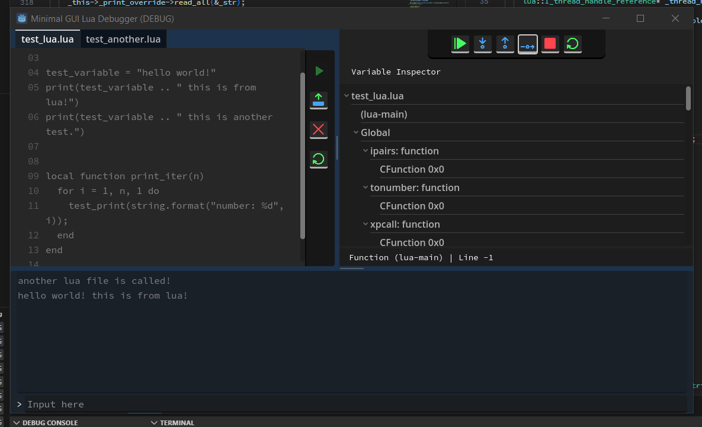
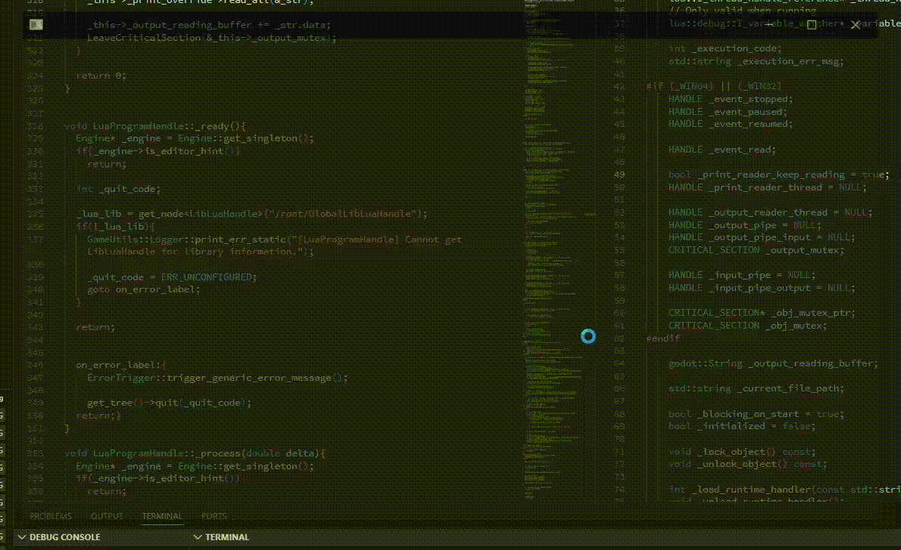
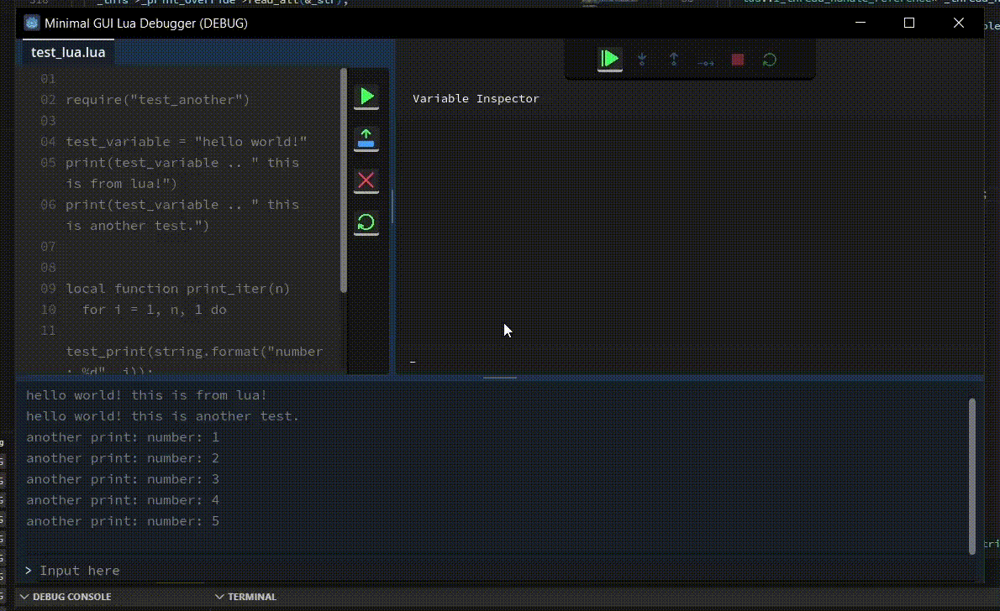
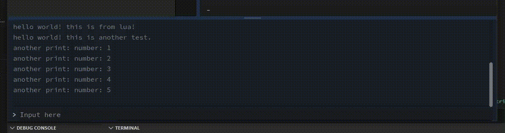
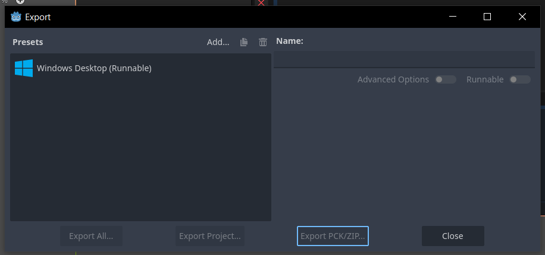

[](https://ko-fi.com/X8X0175H9C)

# Lua Debugger
A debugger made for Lua with Graphical UI made using Godot 4.3.



This is a part of a project: [Lua-Debug-API](https://github.com/NewbySlime/Lua-Debug-API)


##  Features
- Easy to use debugging options.
- Breakpoint feature.
- Code viewer with line indicator for which line it currently runs.
- Variables can be viewed in the variable inspector window.
- Integrated console window for Lua IO.

## How To Use
Open the program, then
Open the target Lua source code


Run it!


Debug options will be available when running the source code

Use Console Window to give input to Lua


## Building
Run the makefile in src/lua_api.make, the instruction are almost the same with Lua-Debug-API. Since the makefile is modified, suited for this build case, we'll have to slightly change how we build.
```
mingw32-make --file=src/lua_api.make --directory=src/Lua-CPPAPI f_use_mingw proc_compile
```

Run Sconstruct file in the root folder to build Godot user library.
```
scons target=template_release
```
For more info, refer to [this site from Godot docs](https://docs.godotengine.org/en/stable/tutorials/scripting/gdextension/gdextension_cpp_example.html#building-the-c-bindings).

Open Godot with this project, and build it in the **Project/Export** menu.



## Known Problem
- Pausing or Stopping while running thread blocked due to IO Library will cause the whole program to hang.

## Planned Features
- ~~Breakpoints~~
- Partial reveal for Variable Watcher
- Editing using variable watcher
- Seperating debugger and user programs by using IPC (in case of the Lua program does not respond)?
- File editing?

## Contributing
Any contributions are appreciated, make sure to state your problems or features. You might also want to expect on some long delay in merging since I'm still in University.