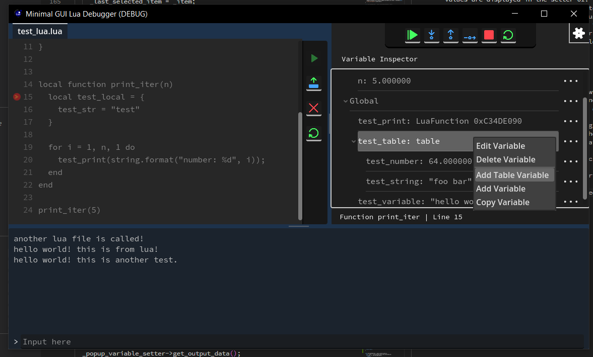

[](https://ko-fi.com/X8X0175H9C)

# Lua Debugger
A debugger made for Lua with Graphical UI made using Godot 4.3. Currently only works on Windows.



This is a part of a project: [Lua-Debug-API](https://github.com/NewbySlime/Lua-Debug-API)


##  Features
- Easy to use debugging options.
- Breakpoint feature.
- Code viewer with line indicator for which line it currently runs.
- Variables can be viewed in the variable inspector window.
- Integrated console window for Lua IO.

## Limitations
- This only works on Windows as of now (Windows 10 19045). Considering on creating Linux version of the project.

## How To Use
Open the program, then
Open the target Lua source code


Run it!


Debug options will be available when running the source code

Use Console Window to give input to Lua


## Building
Run the makefile in src/lua_api.make, the instruction are almost the same with Lua-Debug-API. Since the makefile is modified, suited for this build case, we'll have to slightly change how we build.
```
mingw32-make --file=src/lua_api.make --directory=src/Lua-CPPAPI f_use_mingw proc_compile
```

If you want to use MSVC to compile, you can use `f_use_msvc` flags. An important note, you have to use Visual Studio environments by running `vsdevcmd` and `vcvars64` or `vcvars32`.
```
vsdevcmd.bat && vcvars64.bat && mingw32-make --file=src/lua_api.make --directory=src/Lua-CPPAPI f_use_msvc proc_compile
```

Run Sconstruct file in the root folder to build Godot user library.
```
scons target=template_release
```
For more info, refer to [this site from Godot docs](https://docs.godotengine.org/en/stable/tutorials/scripting/gdextension/gdextension_cpp_example.html#building-the-c-bindings).

Open Godot with this project, and build it in the **Project/Export** menu.


## Optimized Engine Build
Since this program does not fully utilize Engine's function, we have to give it some optimization in order to remove unused features. Thus we need to recompile Engine binaries. Use [this file](export_build_profile/GUI-App.py) as the compiling configuration. Refer [to this article](https://docs.godotengine.org/en/stable/contributing/development/compiling/introduction_to_the_buildsystem.html#overriding-the-build-options) on how to use it.

Then run Sconstruct to compile the export template on the Engine's source code root folder.
```
scons target=template_release platform=your_os_type arch=your_arch_type
scons target=template_debug platform=your_os_type arch=your_arch_type
```
NOTE: "platform" parameter can only be filled with "windows".

After that, set "Custom Template" parameter in exporting configuration window with the compiled template binaries from the previous step.

## Known Problem
- Pausing or Stopping while running thread blocked due to IO Library will cause the whole program to hang.

## Planned Features
These planned features are uncertain as of now, end goal of the project might change over time. Reason for uncertainty is due to this project being a personal learning project. As for now, I wanted to push the limits of what I can do with Lua code.
Note: the list is ordered by priority, top is highest priority, bottom is lowest priority.
- Reference List (holding Table and Function values as reference)
- Editing values using VariableWatcher (not yet for Table and Functions)
- Linux Support
- Stack view (containing currently running functions)
- Seperating debugger and user programs by using IPC (in case of the Lua program does not respond)?
- Stats monitor
- File editing (maybe?)
- ~~Breakpoints~~
- ~~Partial reveal for VariableWatcher~~

## Contributing
Any contributions are appreciated, make sure to state the problems in the app or wanted features. You might also want to expect on some short delay in merging since I'm still in University.

As simple as reporting an issue also helps the project to grow!

## Found Issues or any Ideas?
If you find any issues or any ideas, you can directly report it in the Issues tab or discuss it in the Discussion, I'll respond to it as soon as I can. I will not accept any kind of message privately, unless in important context.
